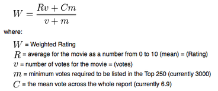

# recommender

From tutorial: [https://www.kaggle.com/ibtesama/getting-started-with-a-movie-recommendation-system](https://www.kaggle.com/ibtesama/getting-started-with-a-movie-recommendation-system)

## cmd

```sh
jupyter lab recommender.ipynb
```

## 3 types

There are basically three types of recommender systems:-

- Demographic Filtering- They offer generalized recommendations to every user, based on movie popularity and/or genre. The System recommends the same movies to users with similar demographic features. Since each user is different , this approach is considered to be too simple. The basic idea behind this system is that movies that are more popular and critically acclaimed will have a higher probability of being liked by the average audience.

- Content Based Filtering- They suggest similar items based on a particular item. This system uses item metadata, such as genre, director, description, actors, etc. for movies, to make these recommendations. The general idea behind these recommender systems is that if a person liked a particular item, he or she will also like an item that is similar to it.

- Collaborative Filtering- This system matches persons with similar interests and provides recommendations based on this matching. Collaborative filters do not require item metadata like its content-based counterparts.

## Demographic Filtering

IMDB weighted rating algorithm will be used:

